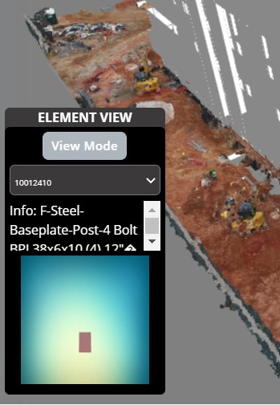
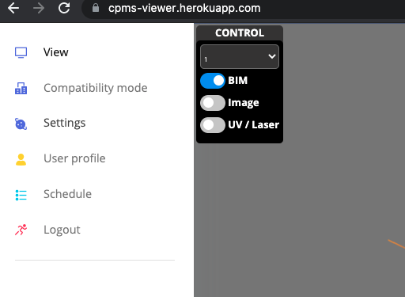
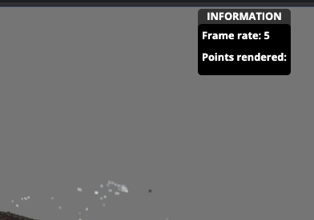
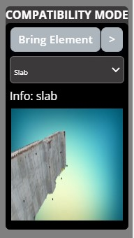
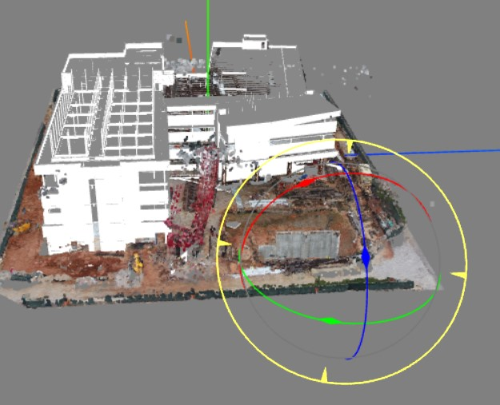
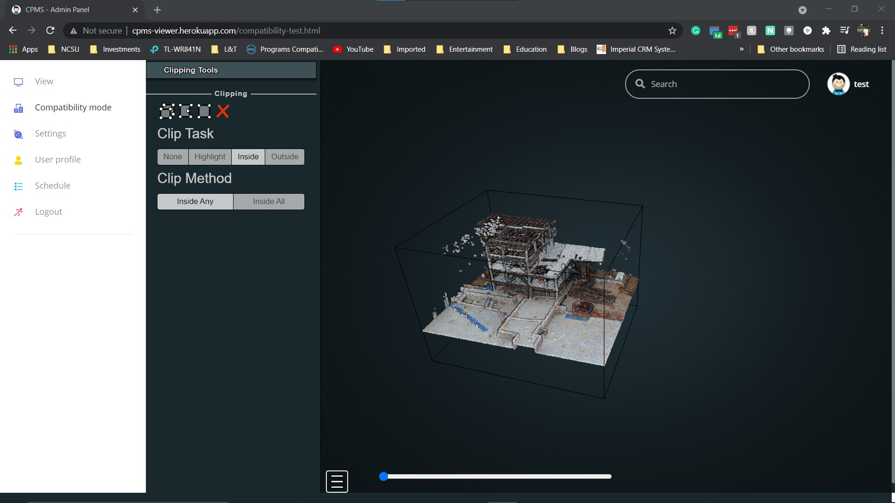
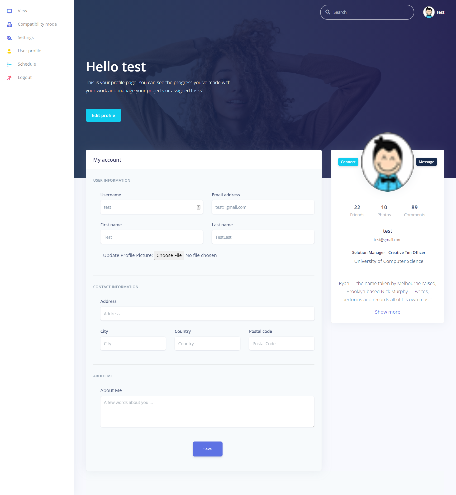
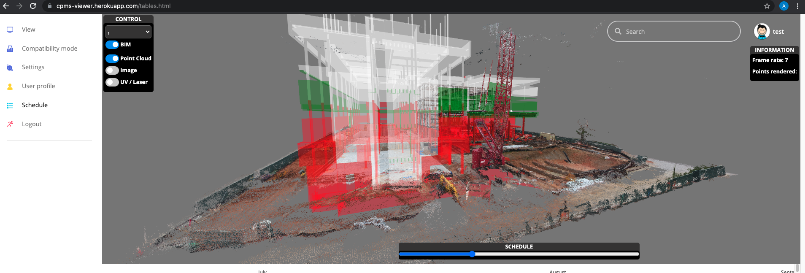
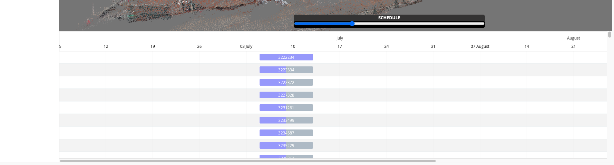
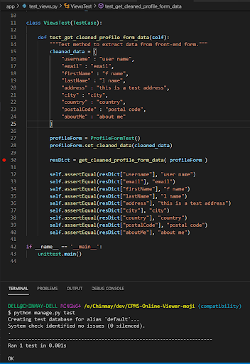

# CPMS Online Viewer

Live App: 
<a href="http://cpms-viewer.herokuapp.com/" target="_blank">http://cpms-viewer.herokuapp.com/</a>

Application to enable loading, viewing and modifying 3-D generated construction models and point clouds on the Web using only front-end technology stack. Major functionalities of the application include:
- Dynamic construction schedule viewer
- Element View
- Point Cloud Compatibility View
- Picture overlay

Description video: https://www.youtube.com/watch?v=gv7z00ireis

## Technology Stack:
- Three.js r110
- Potree 1.6
- Python 3
- Django 2.1

Refer to [requirements.txt](https://github.com/mojtaba1995/CPMS-Online-Viewer/blob/main/requirements.txt) for other dependencies.

## How to install:

1. Clone this repository.
2. In project root, run `pip3 install -r requirements.txt` to install dependencies.

## How to run:
From the project root, run the following commands:

```
python manage.py makemigrations
python manage.py migrate

python manage.py createsuperuser

python manage.py runserver
```

## Technical Documentation:

### Important Directories

| Component | DIR Path |
| -------------- | ---------- |
| Front-end application | core/ |
| Django Back-end application | app/ |
| Application dependencies | requirements.txt |
| Templates | core/templates/ |
| Static code assets | core/static/assets/ |
| Three.js Library | core/static/assets/three/ |
| Potree Library | core/static/assets/three/potree-main/ |
| Signals.js Library | core/static/assets/signals/ |
| Misc JavaScript Dependencies | core/static/assets/js/ |
| Main Point Clouds | https://mojtaba1995.github.io/clouds/cloud1/cloud.js </br> https://mojtaba1995.github.io/clouds/cloud2/cloud.js </br> https://mojtaba1995.github.io/clouds/cloud3/cloud.js |
| Compatibility Panel Point Clouds | core/static/assets/pointclouds/ |

</br>
</br>

### View Page

| Feature | Source Code File |
| -------------- | ---------- |
| BIM Load | core/templates/index.html |
| Point Cloud Load | core/templates/index.html |
| Element View Panel | core/templates/index.html |
| Control Panel | core/templates/index.html |
| Information Panel | core/templates/index.html |
| Compatibility Panel | core/static/assets/js/CompatibilityPanel.js |
| Transform Panel | core/static/assets/js/CompatibilityPanel.js |

**BIM Load Code in index.html:**
```javascript
const loader = new THREE.ObjectLoader();
let mainObj = null;

function loadMainObj( obj ) {
    // Add the loaded object to the scene
    obj.position.set(-180, -100, 120);
    obj.name = "BIM";
    
    scene.add( obj );

    mainObj = obj;

    EV.populateElementsDropdown(obj);
}

function mainObjLoadingProgress( xhr ) {
    console.log( (xhr.loaded / xhr.total * 100) + '% loaded' );
}

function mainObjLoadingError( err ) {
    console.error( 'An error happened' );
}

loader.load( "/static/assets/fbx/scene.json", obj => loadMainObj( obj ), xhr => mainObjLoadingProgress( xhr ), err => mainObjLoadingError( err ) );
```

**Point Cloud Load Code in index.html:**
```javascript
function loadPointCloud(url, position)
{
    Potree.loadPointCloud(url, "pointcloud", function(e)
    {
        var points = new Potree.Group();
        points.setPointBudget(500000);
        points.name = "objectName" + String(counter);
        points.material.opacity = 0.0;
        points.material.wireframe = false;
        
        scene.add(points);

        var pointcloud = e.pointcloud;

        if(position !== undefined)
        {
            pointcloud.position.copy(position);
        }

        var material = pointcloud.material;
        material.size = 2;
        material.pointColorType = Potree.PointColorType.RGB; //RGB | DEPTH | HEIGHT | POINT_INDEX | LOD | CLASSIFICATION
        material.pointSizeType = Potree.PointSizeType.ADAPTIVE; //ADAPTIVE | FIXED
        material.shape = Potree.PointShape.SQUARE; //CIRCLE | SQUARE

        points.add(pointcloud);
    });
}
```


#### **Element View Panel:**
The Element View panel loads at startup and offers a dropdown list of all the elements in the BIM.</br>
Once an element is selected from the dropdown, its information (description and name) is populated in the info field and the element is loaded in the canvas.</br>
The Compatibiltiy Check button is used to toggle the Compatibility Mode/View Mode panel on the bottom right of the View page.

**index.html Element Panel Code:**
```javascript
// When the value in Element Panel drop down changes
$("#element-panel-select").change(() => {

    // Get selected option's element name
    let selectedOptionIndex = $("#element-panel-select").prop('selectedIndex');
    let selectedOptionName = $("#element-panel-select")[0].options[selectedOptionIndex].getAttribute('name');
    console.log('Selected option name: '+ selectedOptionName);

    // Use helper method to set Info string in Element Panel
    let selectedElementTypeString = $("#element-panel-select").val();
    EV.setElementInfo(selectedElementTypeString);

    // Use helper method to set selected element in canvas in Element Panel
    var selectedchildObj = mainObj.getObjectByName(selectedOptionName);
    console.log(selectedchildObj);
    EV.loadElementObject(selectedchildObj);
});
```



#### **Control Panel:**
The Control panel displays diffrent checkboxes to enable and disable diffrent elements.</br>
BIM checkbox enables and diables the BIM </br>
Point cloud check box enables and disables the point cloud.

**index.html Control Panel Code:**
```javascript
//description: function to hide and unhide the bim based on the checkbox value
var bim = document.getElementById("bim");
bim.addEventListener('change',function() {
	scene.getObjectByName("BIM").visible = !scene.getObjectByName("BIM").visible;
});

//description: function to hide and unhide the point cloud based on the checkbox value
var pointCloud = document.getElementById("pointCloud");
pointCloud.addEventListener('change',function() {
pcflag = !scene.getObjectByName("objectName1").visible;
    scene.getObjectByName("objectName1").visible = !scene.getObjectByName("objectName1").visible;
});
```



#### **Information Panel:**
Displays Frame rate per second value continuously</br>


**index.html Information Panel Code:**
```javascript
//description: Calculating FPS to display in information pannel
var lastTime = ( performance || Date ).now();
var count = 0;
function fpsUpdate() { 
	var currentTime = ( performance || Date ).now();
	// currentTime - lastTime is the number of milliseconds passed from last loop 
	var fps = 1000 / (currentTime - lastTime);
	lastTime = currentTime;
	count += 1;
	f(count == 30){
		count = 0;
		document.getElementById("frameRate").textContent = fps.toFixed(0);
	}
}
```




#### **Compatibility Mode Panel:**
The Compatibility Mode panel loads at startup and offers a dropdown list of all point clouds corresponding BIM elements.</br>
Once an point cloud is selected from the dropdown, its information (name) is populated in the info field and the it is loaded in the panel canvas.</br>
The Bring Element button is used to load the selected point cloud in the main canvas with the BIM and the main point cloud, where the loaded point cloud can be transformed and placed where needed.

**index.html Compatibility Panel Bring Element Code:**
```javascript
// Load Selected POint Cloud on Bring Element button click.
// Get selected point cloud from Compatibility Panel object.
compatibilityPanel.signals.bringElementButtonClicked.add( () => compatibilityPanel.getSelectedPointCloud().then( loadSelectedMesh ).catch( errorAlert ) );

function errorAlert( error ) { 

    console.error( error );
    alert('Invalid Compatibility Point Cloud Selection.'); 

}

var bringElementShape = null;

function loadSelectedMesh( shapeToLoad ) {

    if ( shapeToLoad == null ) {

        alert ( 'Select a point cloud in Compatibility Panel first!' );

    } else {

        scene.add( shapeToLoad );

        bringElementShape = shapeToLoad;

        attachTransformControls( shapeToLoad );

    }
}
```

 

</br>
</br>

### **Compatibility Page (In Progress)**
| Feature | Source Code File |
| -------------- | ---------- |
| Cross Section Viewer | core/templates/compatibility-test.html |

The Compatibility page, when complete, should display the main point cloud and a cross section of the point cloud in two canvases side-by-side.</br>
The source of the cross-section should would be a plane that is overlayed on the point cloud in the first canvas, and the cross-section that is generated in the second canvas is the section of the point cloud that is present inside the intersecting plane.


*Intermediate page for Compatibiltiy View*

</br>
</br>

### **User Profile Page**
| Feature | Source Code File |
| -------------- | ---------- |
| User Profile Form | app/forms.py </br> app/views.py </br> app/models.py |
| Profile Pictures | Database |

The profile page presents a form with the logged in user details that are stored in the database, and gives a mechanism to modify those details.</br>
User can just change the values to be modified and press on Save, which saves the form with the new values. </br>
User can also change their profile picture, which for now is stored in the database. </br>
In the DEV environment, the and SQLite database is used, whereas PostGRESQL is used on Heroku by default to store user details.

**Profile Form in app/forms.py**
```python
class ProfileForm(forms.Form):
    username = forms.CharField(
        required=True,
        widget=forms.TextInput(
            attrs={
                "id":"input-username",
                "placeholder": "Username",
                "class": "form-control form-control-alternative"
            }
        )
    )
    email = forms.EmailField(
        required=True,
        widget=forms.EmailInput(
            attrs={
                "id":"input-email",
                "placeholder": "Email Address",
                "class": "form-control form-control-alternative"
            }
        )
    )
    firstName = forms.CharField(
        required=False,
        widget=forms.TextInput(
            attrs={
                "id":"input-first-name",
                "placeholder": "First Name",
                "class": "form-control form-control-alternative"
            }
        )
    )
    lastName = forms.CharField(
        required=True,
        widget=forms.TextInput(
            attrs={
                "id":"input-last-name",
                "placeholder": "Last Name",
                "class": "form-control form-control-alternative"
            }
        )
    )
    address = forms.CharField(
        required=False,
        widget=forms.TextInput(
            attrs={
                "id":"input-address",
                "placeholder": "Address",
                "class": "form-control form-control-alternative"
            }
        )
    )
    city = forms.CharField(
        required=False,
        widget=forms.TextInput(
            attrs={
                "id":"input-city",
                "placeholder": "City",
                "class": "form-control form-control-alternative"
            }
        )
    )
    country = forms.CharField(
        required=False,
        widget=forms.TextInput(
            attrs={
                "id":"input-country",
                "placeholder": "Country",
                "class": "form-control form-control-alternative"
            }
        )
    )
    postalCode = forms.IntegerField(
        required=False,
        widget=forms.NumberInput(
            attrs={
                "id":"input-postal-code",
                "placeholder": "Postal Code",
                "class": "form-control form-control-alternative"
            }
        )
    )
    aboutMe = forms.CharField(
        required=False,
        widget=forms.Textarea(
            attrs={
                "id":"input-last-name",
                "placeholder": "A few words about you ...",
                "rows":"4",
                "class": "form-control form-control-alternative"
            }
        )
    )
    profilePicture = forms.ImageField(
        required=False
    )
    bio = forms.CharField(
        required=False,
        widget=forms.TextInput(
            attrs={
                "placeholder": "bio",
                "class": "form-control form-control-alternative"
            }
        ))
    location = forms.CharField(
        required=False,
        widget=forms.TextInput(
            attrs={
                "placeholder": "location",
                "class": "form-control form-control-alternative"
            }
        ))
```



</br>
</br>

### **Schedule Page**
| Feature | Source Code File |
| -------------- | ---------- |
| Schedule viewer | core/templates/tables.html |
| Gantt chart | core/templates/tables.html |


#### **Schedule:**
The Schedule page  displays the schedule of the construction site by changing the colour of the elements based on their state </br>
Initially bim will be transparent white(0.4 transparency), as we move the schedule range inprogress elements will be shown in green colour, behind the schedule elements will be shown in red and completed elements will be opaque white.

**tables.html Schedule viewer Code:**
```javascript
//description: changes the opacity of the elements based on their progress.
function timelineValChange(){
	if (scene.getObjectByName('BIM') === undefined) return;	
	if(oldVal == timeline.value)return;
	var completedElements = getCompletedElementsName();
	var inprogressElements = getInProgressElements(timeline.value);
	var behindScheduleElements = getBehindSheduleElements(timeline.value);
	console.log(completedElements);
	var modelElements = [];
	scene.getObjectByName('BIM').traverse(function (node) {
		if(node.isMesh){
            //to display elements in transparent white at first
			if( completedElements.includes( getElementId(node) )){
				modelElements.push(node.name);
				node.material = new THREE.MeshBasicMaterial({color: "white"}); 
			}
            //to display completed elements in green
			else if( inprogressElements.includes( getElementId(node) )){
				node.material = new THREE.MeshBasicMaterial({color: "green"});
				node.material.transparent = true;
				node.material.opacity = 0.4;
				}
            //to display behind the schedule elements in red
			else if( behindScheduleElements.includes(getElementId(node))){
			    node.material = new THREE.MeshBasicMaterial({color: "red"});
				node.material.transparent = true;
				node.material.opacity = 0.4;
			}// to display completed elements in solid white.
            else{
				node.material = new THREE.MeshBasicMaterial({color: "white"});
				node.material.transparent = true;
				node.material.opacity = 0.4;
				}
             }
            });
		oldVal = timeline.value;
	}
```



</br>
</br>

#### **gantt chart:**
The Schedule page  displays the gantt chart of the construction site.Each element of the construction is considered as single tasks. Tasks will have task ID(which is loaded from schedule.json) , percentage completed and also the link between critical paths between each task. This schedule of the single element can be found in schedule.csv and the corresponding elements are loaded from the csv</br>


**tables.html Gantt Chart Code:**
```javascript

//description: in built function to draw the gantt chart from frappiee gantt chart
//input: tasks which has different subtasks and its schedule
//output: draws a gantt chart in the div id #gantt-target
function drawChart(){
	if(tasks.length === 0 ) return;
	var gantt_chart = new Gantt("#gantt-target", tasks, {
		on_click: function (task) {
		    console.log(task);
		},
		on_date_change: function(task, start, end) {
			console.log(task, start, end);
		},
		on_progress_change: function(task, progress) {
		    console.log(task, progress);
		},
		on_view_change: function(mode) {
			console.log(mode);
		},
		view_mode: 'Week',
		language: 'en',
		});
	console.log(gantt_chart);
}
```



</br>
</br>

## Testing
### UI and Testing 
UI and JavaScript testing is done using the Katalon Studio framework.

UI Testing Repository: https://github.com/cterse/cpms-ui-testing

### Backend Python Testing
The default unit testing module `unittest` is used to perform Unit testing for the Django app.

**Tests File:** test_views.py, tests.py

**How to run:** Run the command `python manage.py test`. Django automatically detects and runs file named ‘test_*’ and functions named ‘test_*’ when the command python manage.py test is run.

Python Example Unit Test:

</img>

## Team
[Mojtaba Noghabaei](https://github.com/mojtaba1995) </br>
[Chinmay Terse](https://github.com/cterse) </br>
[Arpitha Vijaykumar](https://github.com/VArpitha)
